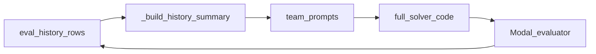

# Week 12 Report — History-Aware AirBench Team Proposer (GEPA)

## Problem statement (standalone recap)

We optimize a **complete Python training script** for the [AirBench CIFAR-10](https://github.com/KellerJordan/cifar10-airbench) setting: run on a single **NVIDIA A100-40GB**, hit at least **94.00%** test-time-augmented (TTA) accuracy, and among programs that meet that bar minimize **`mean_time_seconds`** reported by the script’s final JSON line. The optimization unit is **`solver_code`** (a full program), evaluated remotely (Modal) under a fixed PyTorch stack and CLI/JSON contract.

For the full scoring rule, evaluator behavior, Modal harness, seed baseline path, and failure-mode discussion, see [week8_report.md](week8_report.md).

### Project arc (background, not “last commit” news)

Since Week 8 we have continued three threads in parallel: **GEPA** over full programs (`scripts/airbench_gepa/`), a **Gemini-oriented autoresearch** loop (`scripts/airbench_autoresearch/`), and shared **AirBench** evaluation on Modal. The **newest committed engineering** described below is from **2026-03-22** (commit `2eaf591`); the repository snapshot used for this report contains **no commits after that date**, so Week 12 summarizes work through that point.

---

## Technical approach — what changed in the latest commit

### 1. History-aware team proposer

The multi-agent AirBench proposer (coordinator, performance, reliability, integrator, reviewer) remains in [`scripts/airbench_gepa/agent_team_proposer.py`](scripts/airbench_gepa/agent_team_proposer.py). The Week 12 delta adds **structured evaluation history** into team prompts when enabled:

- [`scripts/airbench_gepa/run_gepa_airbench94.py`](scripts/airbench_gepa/run_gepa_airbench94.py) exposes `--history-aware-proposer` / `--no-history-aware-proposer` (default: **on**) and `--history-window` (default: **8**).
- The proposer builds a JSON **history summary** (`_build_history_summary`, `_derive_history_lessons`) from recent evaluation rows: best-by-score and best-by-accuracy rows, target-meeting candidates, a compact **recent trajectory**, and short **derived lessons** (for example, reminders to preserve CLI/JSON and compile invariants when prior rows succeeded).
- That summary is injected as **“Persistent history side information”** in coordinator and worker prompts (and related reviewer-style paths), so later proposals can see **what was already tried** and how it scored, not only the current solver string.
- Each team session writes **`round_*_history.json`** next to the other agent artifacts under `agent_team/session_*/`, which makes the history payload inspectable after a run.

Conceptually:

### 2. Documentation: two runnable paths

[`docs/airbench_setup.md`](docs/airbench_setup.md) was expanded to describe a **recommended Gemini + autoresearch** path (`scripts/airbench_autoresearch/`, smoke check via `run_candidate.py`, loop via `run_loop.py`) alongside the fact that [`run_gepa_airbench94.py`](scripts/airbench_gepa/run_gepa_airbench94.py) is more tightly coupled to reflection-model auth patterns used with GEPA. Modal remains required for GPU evaluation in both cases.

### 3. Course collateral (repository history)

Per git history, **Week 9 presentation materials** were added on **2026-03-20** (commits `9cfbc1e` / `92c913b`). Those files are not present in every checkout of the repo; if your clone includes a `Presentation Documents/` tree, refer there for the PDF.

---

## Results — committed GEPA runs (2026-03-22)

We summarize two runs under [`data/airbench/gepa_runs/`](data/airbench/gepa_runs/) that differ only in **`history_aware_proposer`** in the saved config; both use the same seed (`scripts/airbench_gepa/seeds/airbench94_baseline.py`), **`proposal_strategy=team`**, **`team_rounds=1`**, **`max_metric_calls=4`**, search-time **`trials=1`** with **`verify_trials=3`** for the reported best-program verification, and **`reflection_model` / `refiner_model`**: `gemini/gemini-3.1-flash-lite-preview`.

### Run A — history off: `20260322_173100`

| Field | Value |
| --- | --- |
| `history_aware_proposer` | `false` |
| Total run wall time | ~1332.7 s ([`summary.json`](data/airbench/gepa_runs/20260322_173100/summary.json)) |
| GEPA `total_metric_calls` | 5 |
| Best verified (3 trials) | mean accuracy **0.94047**, mean time **2.584 s** ([`best_verified_eval.json`](data/airbench/gepa_runs/20260322_173100/best_verified_eval.json)) |
| Best search-time score | Remained **seed / base_recheck** (metric calls 1–2); no GEPA candidate beat the incumbent on the lexicographic score ([`eval_log.jsonl`](data/airbench/gepa_runs/20260322_173100/eval_log.jsonl)) |

Observed GEPA outcomes included runtime errors, syntax errors, sub-threshold accuracy, and one run that **met target** at **~0.9435** accuracy but **~5.50 s** time—worse on the time objective than the seed-like line.

### Run B — history on: `20260322_175827`

| Field | Value |
| --- | --- |
| `history_aware_proposer` | `true` |
| Total run wall time | ~1087.0 s ([`summary.json`](data/airbench/gepa_runs/20260322_175827/summary.json)) |
| GEPA `total_metric_calls` | 4 |
| Best verified (3 trials) | mean accuracy **0.94053**, mean time **2.577 s** ([`best_verified_eval.json`](data/airbench/gepa_runs/20260322_175827/best_verified_eval.json)) |
| Best search-time score | Again **base_recheck** (metric call 2) ([`eval_log.jsonl`](data/airbench/gepa_runs/20260322_175827/eval_log.jsonl)) |

With history enabled, [`agent_team/session_001/round_01_history.json`](data/airbench/gepa_runs/20260322_175827/agent_team/session_001/round_01_history.json) shows a compact **recent trajectory** (seed → base_recheck → failing GEPA candidates) and **derived lessons** aligned with preserving invariants from target-meeting programs.

### Interpretation (cautious)

- **Neither run produced a GEPA candidate that beat the seeded program on the search-time objective**; the best-scoring line in both logs is still the **base_recheck** of the same seed.
- **Verified accuracies and times** for the chosen best program are **very close** between the two runs (~0.94047 vs. ~0.94053 accuracy; ~2.584 s vs. ~2.577 s). Those differences are small relative to Week 8’s concern about **single-trial noise** at the 94% boundary.
- Wall-clock totals differ (~1333 s vs. ~1087 s), but **outer-loop metric calls and candidate outcomes** also differ; this is **not** a clean, matched-cost A/B test of history-aware vs. history-blind alone.

---

## Lessons and next steps

1. **History injection is implemented and observable** (`round_*_history.json`, structured JSON in prompts), which addresses a real gap: the team could previously ignore the sequence of successes and failures across iterations.
2. **Empirical gains on solver quality are not yet demonstrated** by these two runs: the seed remains the practical champion on the stated objective.
3. A **deliberate ablation** (matched `max_metric_calls`, seed, and stopping rule; only toggling `--history-aware-proposer`) with **search** `trials ≥ 2` or softer threshold handling would better answer whether history improves proposals under the Week 8 critique.

For a critical reading of this report and prioritized follow-ups, see [week12_self_critique.md](week12_self_critique.md).
